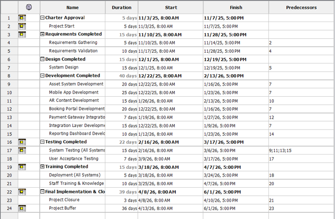
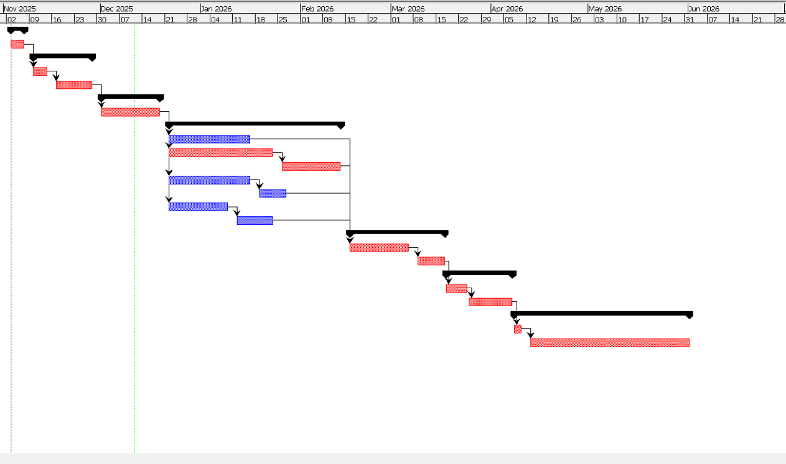

# Turathna Al-Raqmi: Digital Transformation Project Management Plan

A structured IT project management initiative modeling the end-to-end planning, lifecycle decomposition, and scheduling for the **Turathna Al-Raqmi** cultural heritage digital transformation project.

---

## 📌 Executive Summary & Project Scope

The primary objective of this project is to implement an integrated technology ecosystem for heritage preservation and visitor engagement. The scope covers four core technical pillars:
* **Centralized Asset Management System:** Robust database architecture, metadata tagging modules, automated backup systems, and security baselines.
* **AR-Based Visitor Mobile App:** Interactive augmented reality engine and multimedia 3D content integration for museum exhibits.
* **Online Booking & Membership Portal:** Public-facing reservation platform integrated with secure electronic payment gateways.
* **Integration Layer & Reporting Dashboards:** Central API architecture linking backend subsystems to administrative and financial reporting tools.

---

## 🛠️ Project Management Methodologies

### 1. Work Breakdown Structure (WBS) Approach
The WBS was engineered using a hybrid management strategy:
* **Deliverable-Based Approach (Primary):** Level-2 categories are mapped directly to major functional deliverables (Asset Management, AR Mobile App, Booking Portal, Integration Layer, Training, and Quality/Security).
* **Waterfall / SDLC Lifecycle Decomposition:** Each technical deliverable is decomposed into sequential SDLC phases: Requirements -> Design -> Development -> Testing -> Deployment -> Knowledge Transfer.
* **Bottom-Up Decomposition:** Technical activities were further broken down into discrete work packages (e.g., payment gateway APIs, AR 3D assets, cybersecurity compliance audits).

### 2. High-Level WBS Elements (Summary)
* **1.0 Turathna Al-Raqmi Digital Transformation**
  * **1.1 Project Management:** Kickoff, Communication, Risk & Change Control, Project Closure
  * **1.2 Requirements & Analysis:** Stakeholder Identification, Workshops, Validation
  * **1.3 Centralized Asset Management System:** Database Design, Metadata Engine, Deployment
  * **1.4 AR-Based Visitor Mobile App:** UI/UX, AR Engine, 3D Integration, Store Deployment
  * **1.5 Online Booking & Membership Portal:** Backend Architecture, Payment Gateway Integration
  * **1.6 Integration Layer & Reporting Dashboard:** APIs, Financial Middleware, Analytics
  * **1.7 Knowledge Transfer & Training:** Staff Manuals, Hands-on Workshops, Evaluations
  * **1.8 Quality, Security & Compliance:** Cybersecurity Compliance, Penetration Testing, QA Audits

---

## 📅 Schedule, Critical Path & Dependency Analysis

The project schedule and resource timeline were modeled and calculated using **ProjectLibre**:

### Key Milestones
* **Charter Approval:** November 2025
* **Requirements Phase Completed:** Late November 2025
* **System Design Completed:** December 2025
* **Development Completed:** Mid February 2026
* **System & UAT Testing Completed:** Mid March 2026
* **Deployment & Training Completed:** Early April 2026
* **Final Implementation & Project Closure:** June 2026

### Detailed Milestone Schedule

---

## 📊 Visual Artifacts & Network Modeling

### Gantt Chart & Critical Path (CPM)
The Critical Path Method (CPM) was computed to determine overall project duration and identify high-risk dependency chains that directly govern project completion.
* **Critical Path:** Branch 2 (highlighted in red), traversing from Project Initiation through Requirements Validation, System Design, Mobile App Development, AR Content Development, System Testing, Acceptance Testing, and Final Closure.

### Precedence Network Diagram
The activity network diagram illustrates predecessor relationships, task concurrency (such as parallel development of the Asset System, Web Portal, and Integration Layer), and finish-to-start constraints across the execution phase.

---

## 💻 Methodologies & Standards
* **Project Management Standards:** Aligned with PMBOK framework principles (WBS, Critical Path Method, Resource Planning).

* **Scheduling Tool:** ProjectLibre.
